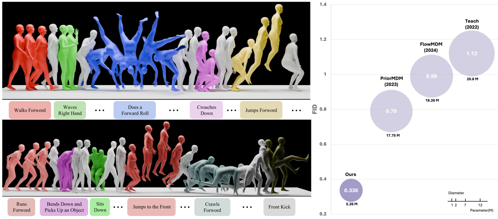

<div align="center"><h1>KMM: Key Frame Mask Mamba for Extended Motion Generation<br>
<!-- <sub><sup><a href="">Preprint</a></sup></sub> -->
</h1>

[Zeyu Zhang](https://steve-zeyu-zhang.github.io)<sup>\*</sup>, [Hang Gao](https://www.linkedin.com/in/hang-gao-725986307/?originalSubdomain=au)<sup>\*</sup>, [Akide Liu](https://www.linkedin.com/in/akideliu/), [Qi Chen](https://chenqi008.github.io/), [Feng Chen](https://github.com/Chenfeng1271), [Yiran Wang](https://www.linkedin.com/in/yiran-wang-101739246/), [Danning Li](https://www.linkedin.com/in/danning-li-448039229/), [Hao Tang](https://ha0tang.github.io/)<sup>✉</sup>

<sup>*</sup>Equal contribution
<sup>✉</sup>Corresponding author: bjdxtanghao@gmail.com

[](https://steve-zeyu-zhang.github.io/KMM/) [](https://arxiv.org/abs/2000.00000) []() []()


</div>

_Human motion generation is a cut-edge area of research in generative computer vision, with promising applications in video creation, game development, and robotic manipulation. The recent Mamba architecture shows promising results in efficiently modeling long and complex sequences, yet two significant challenges remain: Firstly, directly applying Mamba to extended motion generation is ineffective, as the limited capacity of the implicit memory leads to memory decay. Secondly, Mamba struggles with multimodal fusion compared to Transformers, and lack alignment with textual queries, often confusing directions (left or right) or omitting parts of longer text queries. To address these challenges, our paper presents three key contributions: Firstly, we introduce **KMM**, a novel architecture featuring **K**ey frame **M**asking **M**odeling, designed to enhance Mamba's focus on key actions in motion segments. This approach addresses the memory decay problem and represents a pioneering method in customizing strategic frame-level masking in SSMs. Additionally, we designed a contrastive learning paradigm for addressing the multimodal fusion problem in Mamba and improving the motion-text alignment. Finally, we conducted extensive experiments on the go-to dataset, BABEL, achieving state-of-the-art performance with a reduction of more than **57%** in FID and **70%** parameters compared to previous state-of-the-art methods._

<div align="center">
<!-- 
 -->
</div>

<!-- 

## News

<b>(07/22/2024)</b> &#127881; Our paper was invited for a talk at <a href="https://www.mihoyo.com/"><b>miHoYo</b></a>. You can find our slides <a href="https://steve-zeyu-zhang.github.io/MotionMamba/static/pdfs/Motion_Mamba_Slides_miHoYo.pdf"><b>here</b></a>!

<b>(07/05/2024)</b> &#127881; Our paper has been highlighted twice by <a href="https://wx.zsxq.com/dweb2/index/topic_detail/5122458815888184"><b>CVer</b></a>!

<b>(07/02/2024)</b> &#127881; Our paper has been accepted to <a href="https://eccv2024.ecva.net/"><b>ECCV 2024</b></a>!

<b>(03/15/2024)</b> &#127881; Our paper has been highlighted by <a href="https://twitter.com/Marktechpost/status/1768770427680424176"><b>MarkTechPost</b></a>!

<b>(03/13/2024)</b> &#127881; Our paper has been featured in <a href="https://twitter.com/_akhaliq/status/1767750847239262532"><b>Daily Papers</b></a>!

<b>(03/13/2024)</b> &#127881; Our paper has been highlighted by <a href="https://wx.zsxq.com/dweb2/index/topic_detail/1522541851241522"><b>CVer</b></a>!

## Citation

```
@article{zhang2024motion,
  title={Motion Mamba: Efficient and Long Sequence Motion Generation with Hierarchical and Bidirectional Selective SSM},
  author={Zhang, Zeyu and Liu, Akide and Reid, Ian and Hartley, Richard and Zhuang, Bohan and Tang, Hao},
  journal={arXiv preprint arXiv:2403.07487},
  year={2024}
}
```

-->
